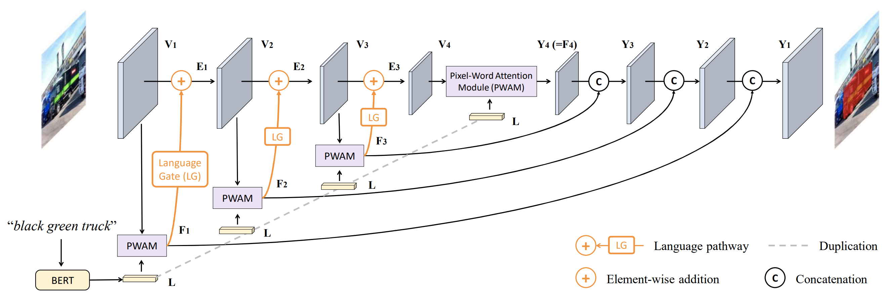
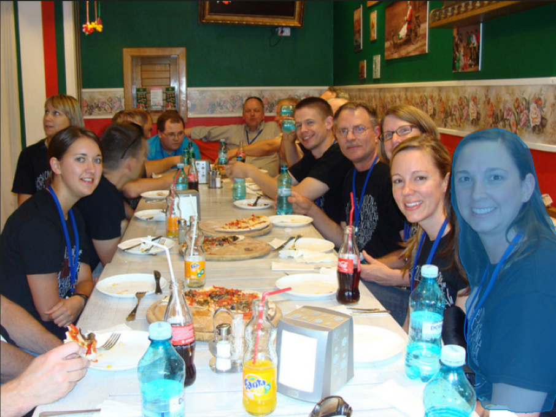

# LAVT: Language-Aware Vision Transformer for Referring Image Segmentation
Note that this document was originally written in Chinese (https://github.com/zichengsaber/LAVT-pytorch).
This is a roughly translated version by @rohjunha. Hope this does not change the original intention.

## Motivation
For referring image segmentation, Pytorch implementations too few. Hope my work can provide a baseline for you !

## Where are we?


Reproduced by @zichengsaber with 45 epochs (12/29/2021):

| ckpt_epoch_45.pth | mIoU   | Overall IoU | prec@0.5 |
| ----------------- | ------ | ----------- | -------- |
| Refcoco val       | 71.949 | 72.246      | 83.42    |
| Refcoco testA     | 74.533 | 75.467      | -        |
| Refcoco testB     | 67.849 | 68.123      | -        |

> Reproduction of the original paper.
> Paper link: https://arxiv.org/abs/2112.02244
> Official implementation: https://github.com/yz93/LAVT-RIS


## Architecture



## Features
* Advance the fusion of different modality features to the Image Encoder stage.
* Relevant papers:
  * *Vision-Language Transformer and Query Generation for Referring Segmentation*
  * *Locate then Segment: A Strong Pipeline for Referring Image Segmentation*
  * https://arxiv.org/abs/2105.01839
* Using a relatively new backbone network, Swin-Transformer; it made a lot of contributions to the improvement.

## Configuration
* Code was tested with RTX 3090 (24GB of VRAM), `pytorch` 1.10.1.
* Refer to `requirements.txt` for packages.

## Dataset
It supports three commonly used datasets:
* refcoco
* refcoco+
* refcocog (G-Ref).

We modified the original API from https://github.com/lichengunc/refer: python 2.7 to 3.

Check some relevant papers:
* ReferItGame: Referring to Objects in Photographs of Natural Scenes
* Modeling Context in Referring Expressions
* Generation and Comprehension of Unambiguous Object Descriptions

## Dataset preparation
Please get details from `./data/readme.md`


## Usage
Detailed arguments can be found in `args.py`.

### Training

```sh
CUDA_VISIBLE_DEVICES=0,1,2,3 torchrun --nproc_per_node 4 --master_port 12345 main.py --batch_size 2 --cfg_file configs/swin_base_patch4_window7_224.yaml --size 448
```

### Resuming the training from a checkpoint

```sh
CUDA_VISIBLE_DEVICES=0,1,2,3 torchrun --nproc_per_node 4 --master_port 12346 main.py --batch_size 2 --cfg_file configs/swin_base_patch4_window7_224.yaml --size 448 --resume --pretrain ckpt_epoch_10.pth
```

### Evaluation

```sh
CUDA_VISIBLE_DEVICES=4,5,6,7 torchrun --nproc_per_node 4 --master_port 23458 main.py --size 448 --batch_size 1 --resume --eval --type val --eval_mode cat --pretrain ckpt_epoch_20.pth --cfg_file configs/swin_base_patch4_window7_224.yaml
```

Make sure all checkpoint files `*.pth` are in the checkpoint directory `./checkpoint`.


## Notes
Some settings from the reproduced code here might be different from the original implementation.
* I chose the pretrained Swin-Transformer with `swin_base_patch4_window12_224_22k.pth`.
You may refer to https://github.com/microsoft/Swin-Transformer/blob/main/get_started.md for specific options.
Images are resized to 448 * 448 for training (https://github.com/microsoft/Swin-Transformer/issues/155).
* No parameters for polynomial learning rate decay were specified in the original paper.
We manually set the parameters and found the initial learning rate is really important.
Especially, you need to descale your initial learning rate with respect to the batch size.
* A single target may correspond to multiple sentences in the RefCOCO dataset.
To deal with this, we randomly assigned a sentence in training and used all sentences in evaluation.
* Currently, the evaluation code only supports the single batch size.
* (Not pretty sure) There are two different modes of evaluation.
  * Concatenate all sentences in to a single sentence: (image, cat(s1, s2, s3))
  * Average the outcomes from multiple examples: (image, s1), (image, s2), (image, s3)


## Visualization
For further detail, please refer to `inference.ipynb`.
Here is a referring example from two input sentences:
> 1. right girl.
> 2. closest girl on right.




## Failure cases study
Failure cases were reported in `AnalysisFailure.ipynb`.
Mainly it focuses predictions less than IoU threshold (0.5): `IoU < 0.1` examples and `0.1 <= IoU < 0.5` examples.
We have seen some failure cases such as:
* Failed to identify similar, dense objects,
* Failed to understand the language,
* Problems of the ground-truth segmentation of RefCOCO.
